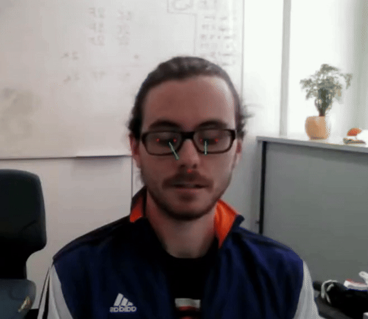

# LaserGaze💥👀 : Real-Time Gaze Direction Estimation

Most libraries for gaze estimation process frames individually. LaserGaze works differently. It’s built to work with temporal data by design and delivers more accurate and stable results for video streams.

| Frame-by-Frame estimation (Park et al, 2018) |                    LaserGaze                    |
|:-------------:|:-----------------------------------------------:|
|  |  |


## Key Features ⛳

- Optimized for real time live video feeds, not static images.
- Dynamically updates and refines gaze estimation as new video frames are processed.
- Uses MediaPipe for cutting-edge facial feature recognition.

## Getting Started ✍️

### Prerequisites

- Python 3.7+
- MediaPipe
- OpenCV-Python
- NumPy
- SciPy

```bash
git clone https://github.com/tensorsense/LaserGaze.git
cd LaserGaze
pip install -r requirements.txt
python main.py
```

### Usage Example

`main.py` shows a basic setup where `GazeProcessor` is initialized with a callback function that prints out the left and right gaze vectors:

```python
async def gaze_vectors_collected(left, right):
    print(f"left: {left}, right: {right}")

async def main():
    vo = VisualizationOptions()
    # can be modified to change the apperance of gaze vectors, eg
    # vo = VisualizationOptions(color=(255, 0, 0), line_thickness=2)
    gp = GazeProcessor(visualization_options=vo, callback=gaze_vectors_collected)
    await gp.start()
```

## How It Works 👩‍🔬

- Use MediaPipe to detect the facial landmarks that aren’t used in mimic movements.
- Align MediaPipe landmarks with a static 3D face model using affine transformations from OpenCV.
- Estimate eyeball size and center in the model space over a number of frames by detecting points on the eyeball.
- Gaze vector in the model space is found by connecting eyeball center with the center of the iris.
- Gaze vector in the image space is found with inverse affine transformation from model space.

## Contributing 🧑‍💻

Contributions are welcome! There are several ways you can contribute:

- **Issue Tracking:** Report bugs or suggest new features.
- **Developing:** Submit your pull requests with new features or bug fixes.
- **Documentation:** Improve or suggest enhancements to the documentation.

## Support 🧑‍🔧

For support, please open an issue on the GitHub project page.

## License 📜

This project is released under the MIT License.

## Happy Tracking! 🤩
